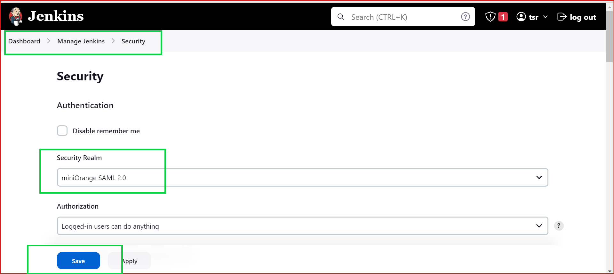

# Jenkins SSO Setup.

## Step 1/6: Install `SSO plugin` on jenkins

**Note:** Install this plugin requires a restart or reboot, to enable it.

## Step 2/6: Create the Jenkins as a provider, click on `miniOrange SAML SSO` and make sure your configurations look like this.

## Step 3/6: Create an enterprise application in azure, and click on SSO to get started with the setup.
Make sure to copy over the details found on `miniOrange SAML SSO` to attribute claims in your enterprise application.

## Step 4/6 Copy the metadata over to jenkins from your app registration, paste it on `IDP configuration` in jenkins.Click on `Enter metadata url:` enter the required information then click on `validate metadata url` and click on save.

## Step 5/6 - Go to manage jenkins and click on `miniOrange SAML SSO` click on it and test you configuration, it should be successful as shown below:

## Step 6/6 Add users to your enterprise application , to allow users access to the jenkins SSO dashboard.
**Note:** For external users, they will get invited to your azure tenant.They must accept to be past of the `IDP SSO` dashboard.

### Successful login would look like this, users most likely should have outlook emails.

