# SSO setup

Step - 1 Install `SSO plugin` on jenkins
Note: Install this lugin with a restart.
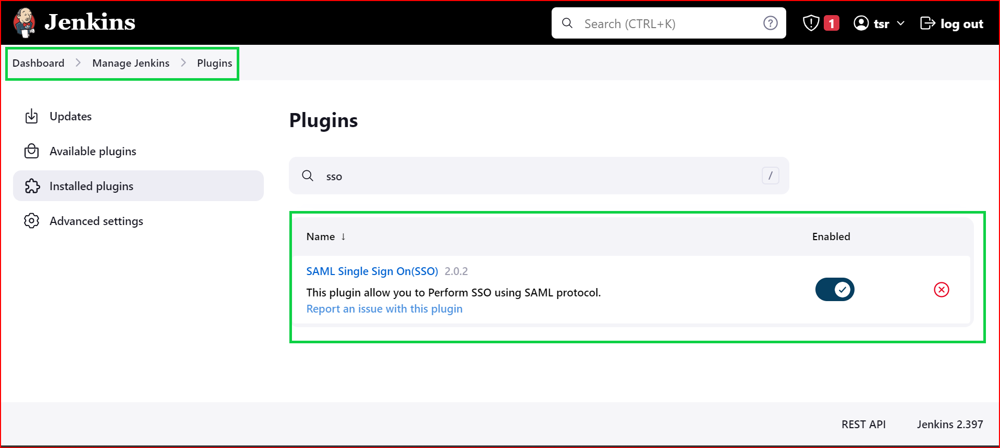

step - 2 Create Jenkins as a provider, click on `miniOrange SAML SSO`
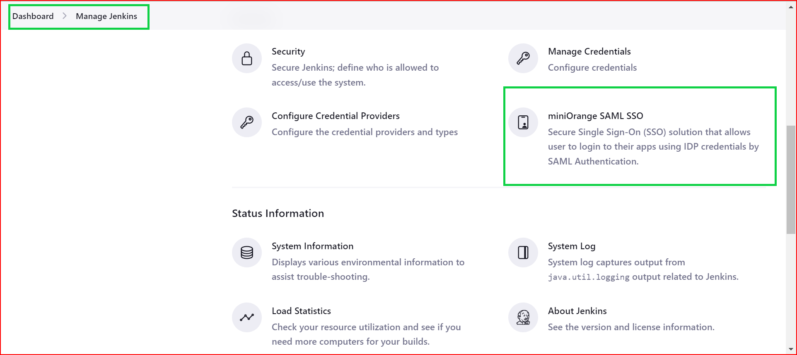
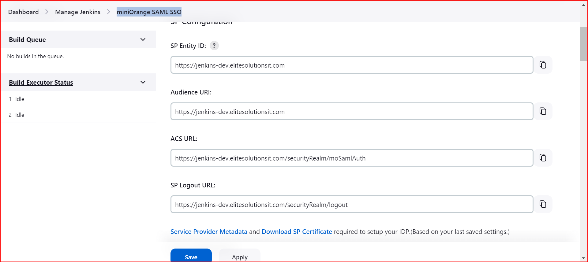

step - 3 create an enterprise application in azure, and click on SSO to get started
copy over the details found on `miniOrange SAML SSO` to attribute claims in your enterprise application.
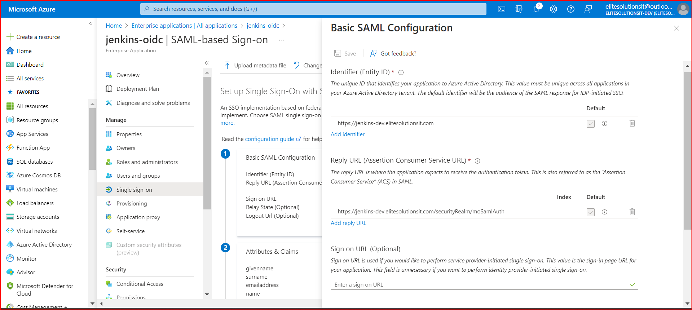
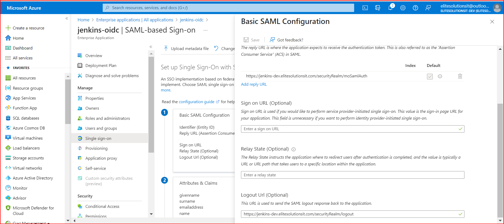

step - 4 copy the metadata over to jenkins from your app registration, paste it on `IDP configuration` in jenkins
paste it on `Enter metadata url:` then click on `validate metadata url` and click on save.
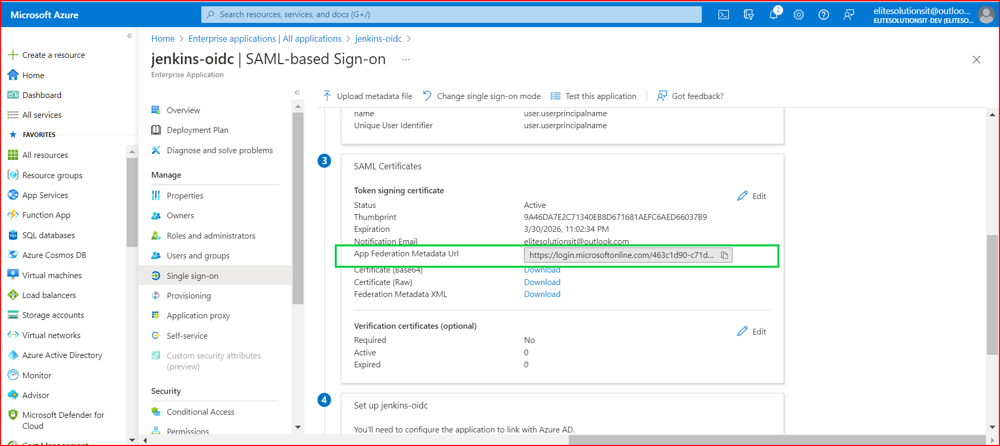

step 5 - go to manage jenkins and click on `miniOrange SAML SSO` click on it and test you configuration, it should be successful as shown below:
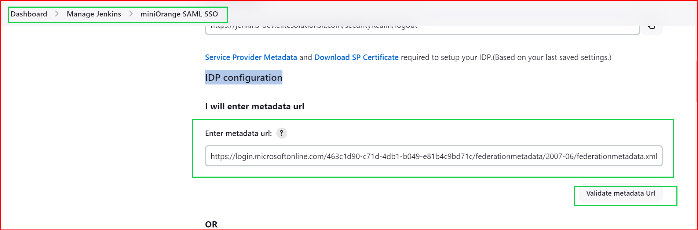
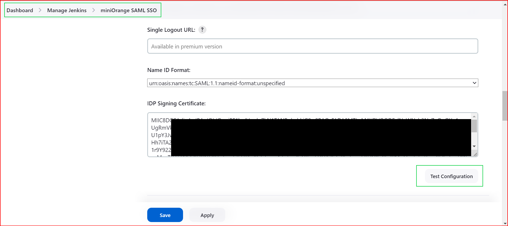
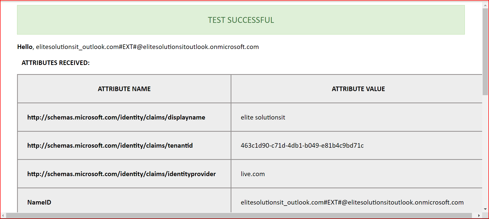

step - 6 Add users to your enterprise application , to allow users access to the jenkins SSO dashboard.
For external users, they get invited to your azure tenant via invite.

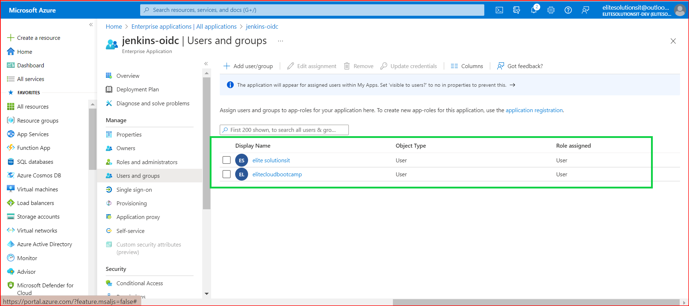

Note:
Invited users must accept thier invitations and also complete testing to jenkins SSO dashboard.

Successful login would look like this, users most lkely should have outlook emails.

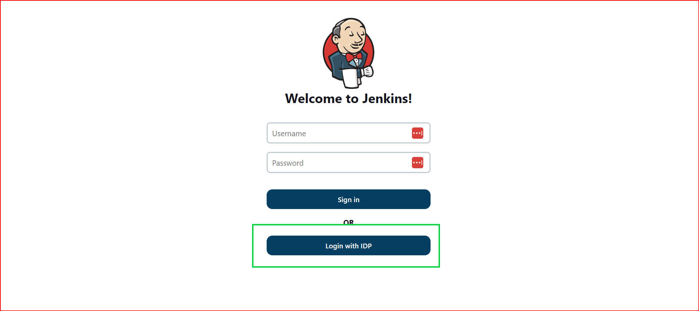
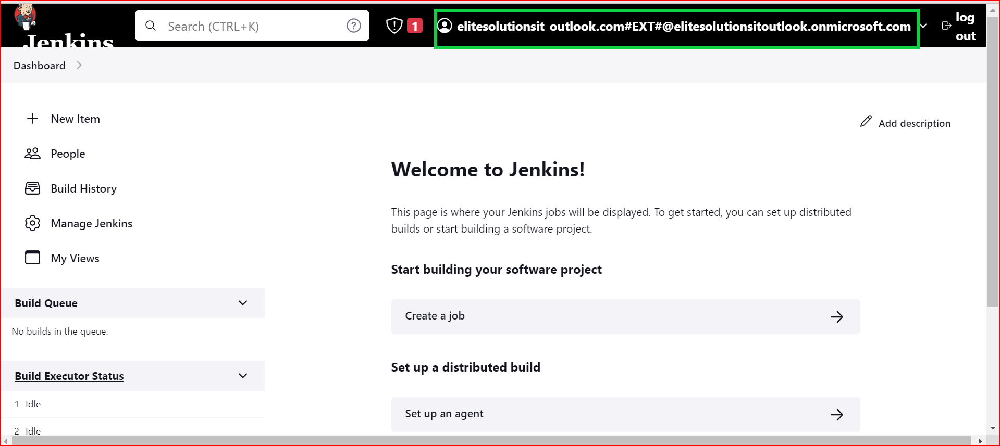

